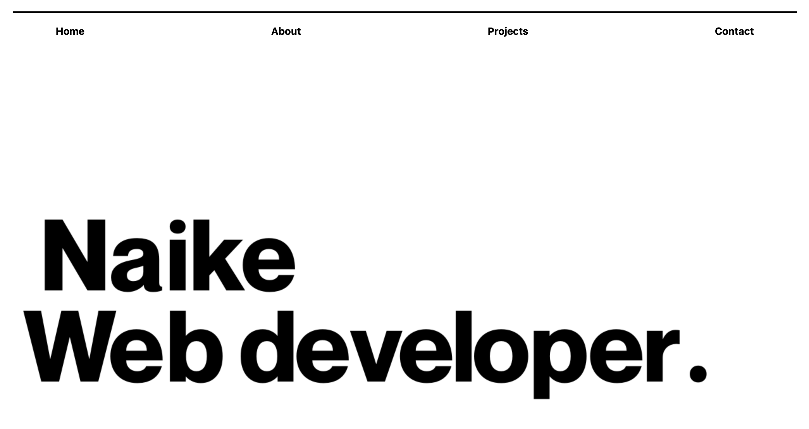

# React Portfolio

## Description

This React application was created for visitors who are looking to hire a web developer. The scope is to provide the visitors with information about me and the skills I'm working to acquire as well as the projects I've worked on so far. In particular, the page includes links that will redirect the visitor to the applications I deployed and links to pages regarding the technologies I'm learning about. It also includes my contact details and links to my profiles on some of the platforms I use such as GitHub and a a link to email me at nbi.study2@gmail.com.

Working on this project, I learned more about using React to build an application with navigation to multiple pages. The application was deployed to Netflify.

## Installation

No installation required.

## Usage

To use this page, navigate to [react-portfolio](). You can use the links at the top, to be redirected to the relative section of the page where you can review the related content.

Here's how the page looks:

## Credits

I'd like to thank my instructor, my TA and my amazing study group for assisting me with building this portfolio.

## License

N/A
